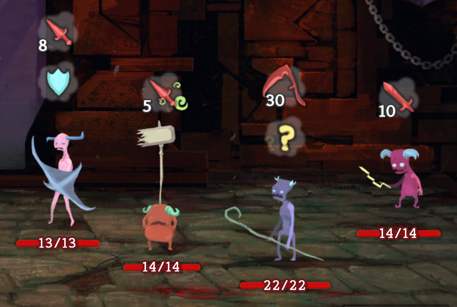
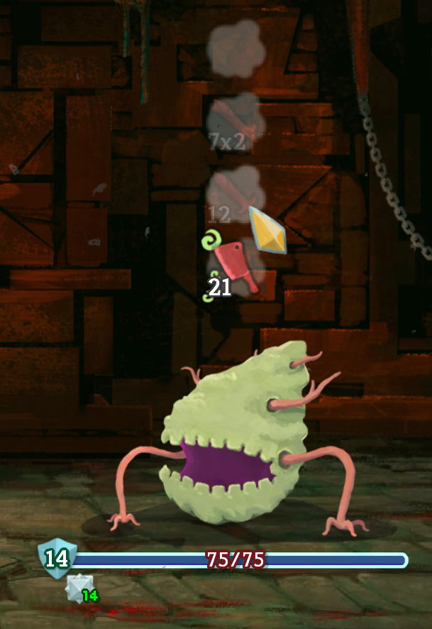
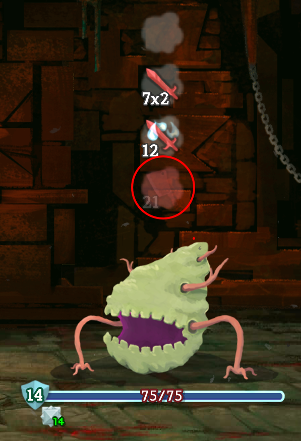
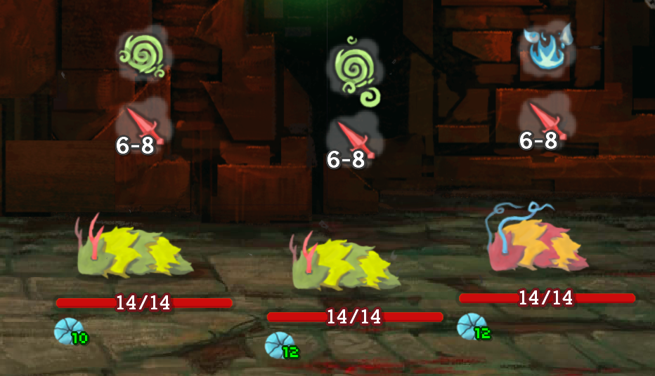
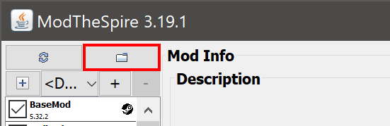
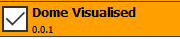

# Dome Visualised

Displays all possible moves of all enemies while in combat when you have Runic Dome. Damage calculated in "real time".

## Usage

Some enemies have a gigantic list of moves. If you believe that the monster will use a specific move (or one of a selected few moves), you can click on the other moves to "toggle" them. This way, you can focus on the move that you believe the monster will use.

After a monster takes their turn, their last move will be coloured red.

Some monsters (louse and darklings to be specific) do not have a fixed base damage for some of their attacks. Their base damage is rolled at the start of each combat. Since the mod should not provide information that the player is not supposed to know, the range of possible damage will be shown instead.

## Installation

1. Go to the [releases](https://github.com/Jerry-Licious/dome-mod/releases) page and find the latest release.
2. Download `dome_mod.jar` from the **Assets** section.
3. Start the mod launcher from Steam by clicking **Play** -> **Play with Mods**.
   * If you do not have the mod launcher, you can get it from the Steam Workshop with [this link](https://steamcommunity.com/sharedfiles/filedetails/?id=1605060445).
   * After subscribing to Mod the Spire, you should be able to open the mod launcher.
4. On the top left of the mod launcher, there should be a *folder button*. Clicking it will open your *mod folder*.
   
5. Copy `dome_mod.jar` (the entire thing, do not extract it) to the mod folder.
6. Restart the mod launcher and click on the Dome Mod to enable it.
   * If the mod is coloured orange in the mod launcher, it means that you do not have **BaseMod** installed.
     
   * BaseMod is the framework that most mods depend on, you can get it from the Steam Workshop with [this link](https://steamcommunity.com/sharedfiles/filedetails/?id=1605833019).
   * After subscribing to BaseMod, restart the mod launcher and enable it.
7. Click **Play** to play with the mod.

## Recommendation

This mod is best played with ojb's [Bestiary](https://github.com/casey-c/bestiary) mod, which lets you look at the details of each move in combat.

## Acknowledgements

Special thanks for ojb for putting the [Bestiary](https://github.com/casey-c/bestiary) on GitHub, which allowed me to collect all the enemy patterns easier.